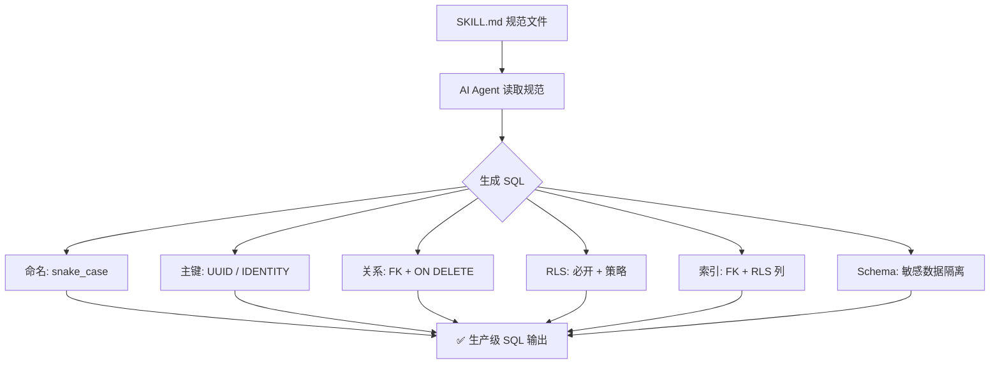

<div align="center">

# 🐘 Supabase Schema Design

**生产级 Supabase/PostgreSQL 建表规范 — 让 AI Agent 写出专业级数据库 Schema**

[](https://github.com/ai-fzx/fzx_supabase_skills)
[](LICENSE)
[](https://supabase.com)
[](https://www.postgresql.org)

</div>

---

## 🎯 这是什么？

一套面向 **AI 编程助手**（Manus、Claude Code、Cursor、Copilot 等）的 Supabase 建表规范 Skill。遵循这些规范，AI Agent 生成的 SQL 将自动满足：

- ✅ 生产级安全（RLS 行级安全必须开启）
- ✅ 高性能（外键必索引、RLS 策略列必索引）
- ✅ 分布式友好（UUID 主键、TIMESTAMPTZ 时间）
- ✅ 可维护性强（snake_case 命名、Schema 隔离）

## ✨ 核心规范速览

| 规范项 | 推荐做法 | 反模式 |
|--------|---------|--------|
| 命名 | `snake_case`，表名复数 | 驼峰、空格 |
| 主键 | `UUID` + `gen_random_uuid()` | `SERIAL` 自增 |
| 字符串 | `TEXT` | `VARCHAR(n)` |
| 时间戳 | `TIMESTAMPTZ` | `TIMESTAMP` |
| 建表后 | 立即 `ENABLE ROW LEVEL SECURITY` | 忘记开 RLS |
| 外键 | 必须加索引 + `ON DELETE` | 无索引外键 |
| RLS 策略列 | 必须加索引 | 策略列无索引 |
| 敏感数据 | 放 `private` schema | 全部放 `public` |

## 🚀 Quick Start

### 1. 安装到你的项目

```bash
# 克隆到你的 skills 目录
git clone https://github.com/ai-fzx/fzx_supabase_skills.git

# 或直接下载 SKILL.md
curl -o SKILL.md https://raw.githubusercontent.com/ai-fzx/fzx_supabase_skills/main/SKILL.md
```

### 2. 放入 AI Agent 的 Skills 目录

```bash
# Claude Code
cp SKILL.md ~/.claude/skills/supabase-schema-design/

# Cursor / Copilot 等支持 Skills 的 Agent
# 放到对应的 skills 目录即可
```

### 🤖 在 Manus 上使用

Manus 原生支持 Agent Skills 开放标准，导入本 Skill 只需两步：

**方式一：从 GitHub 一键导入**

1. 打开 [Manus](https://manus.im)，进入对话界面
2. 输入：`导入 GitHub 技能：https://github.com/ai-fzx/fzx_supabase_skills`
3. Manus 自动读取 `SKILL.md` 并注册技能

**方式二：对话中直接导入**

1. 在 Manus 对话中发送本仓库的 `SKILL.md` 内容
2. 告诉 Manus：**"将此 Supabase 建表规范保存为技能"**
3. Manus 自动打包为可复用技能

**使用方式：**

```
/supabase-schema-design 帮我设计一个电商系统的数据库表
```

> 💡 Manus 采用**渐进式加载**（Progressive Disclosure），即使 SKILL.md 内容丰富，也只在触发时加载指令部分（<5000 tokens），不会浪费上下文窗口。

### 3. 让 AI 按规范建表

```
> 帮我设计一个博客系统的数据库表，遵循 supabase-schema-design 规范
```

AI Agent 将自动生成符合规范的完整 SQL（含 RLS、索引、Trigger）。

## 📋 规范覆盖范围

| 模块 | 内容 |
|------|------|
| 🏷️ 命名规范 | snake_case、表名复数、列名单数 |
| 🔑 主键规范 | UUID vs IDENTITY 选择策略 |
| 🔗 关系设计 | 一对一 / 一对多 / 多对多完整模板 |
| 🔒 RLS 行级安全 | 策略模板 + 性能优化 + 常见陷阱 |
| 🏗️ Schema 隔离 | public vs private 数据隔离 |
| 📇 索引规范 | 外键索引、RLS 索引、低基数列判断 |
| ⏰ 时间字段 | TIMESTAMPTZ + 自动更新 Trigger |
| 📝 完整模板 | 可直接复制使用的建表 SQL |

## 🏗️ 架构概览



## 💡 完整建表示例

```sql
-- 创建表
CREATE TABLE posts (
  id UUID PRIMARY KEY DEFAULT gen_random_uuid(),
  user_id UUID NOT NULL REFERENCES users(id) ON DELETE CASCADE,
  title TEXT NOT NULL,
  content TEXT,
  status TEXT NOT NULL DEFAULT 'draft',
  created_at TIMESTAMPTZ DEFAULT NOW(),
  updated_at TIMESTAMPTZ DEFAULT NOW()
);

-- 启用 RLS（强制！）
ALTER TABLE posts ENABLE ROW LEVEL SECURITY;

-- RLS 策略
CREATE POLICY "Users can manage own posts"
ON posts FOR ALL
TO authenticated
USING (user_id = auth.uid());

-- 索引（外键 + RLS 列必须加）
CREATE INDEX idx_posts_user_id ON posts(user_id);
CREATE INDEX idx_posts_status ON posts(status);

-- 自动更新 updated_at
CREATE TRIGGER update_posts_updated_at
BEFORE UPDATE ON posts
FOR EACH ROW EXECUTE FUNCTION update_updated_at();
```

## ❓ FAQ

<details>
<summary><strong>为什么用 TEXT 而不是 VARCHAR(n)？</strong></summary>

PostgreSQL 中 `TEXT` 和 `VARCHAR` 的性能完全相同。`VARCHAR(n)` 只多了一个长度限制，除非你明确需要限制最大长度（如手机号 11 位），否则用 `TEXT` 更灵活。
</details>

<details>
<summary><strong>为什么必须立即开启 RLS？</strong></summary>

Supabase 不默认启用 RLS。如果表没有启用 RLS，持有 `anon key` 的任何人都可以读写该表的所有数据。这是 Supabase 项目最常见的安全漏洞。
</details>

<details>
<summary><strong>为什么用 UUID 而不是 SERIAL？</strong></summary>

`SERIAL` 是自增整数，在分布式系统（多数据库实例、迁移合并）中容易产生 ID 冲突。`UUID` 全局唯一，天然适合分布式场景。如果需要数字 ID，使用 `IDENTITY` 列替代 `SERIAL`。
</details>

<details>
<summary><strong>这个 Skill 支持 Cursor / Copilot 吗？</strong></summary>

支持。SKILL.md 是纯 Markdown 规范文件，任何能读取 Skills 的 AI Agent 都可以使用。将文件放入对应 Agent 的 skills 目录即可。
</details>

<details>
<summary><strong>如何在 Manus 上使用？</strong></summary>

Manus 原生支持 Agent Skills 开放标准。你可以：
1. 从 GitHub 一键导入：在 Manus 中输入 `导入 GitHub 技能：https://github.com/ai-fzx/fzx_supabase_skills`
2. 对话导入：将 SKILL.md 内容发给 Manus，说"将此保存为技能"
3. 使用时输入 `/supabase-schema-design` 即可触发

Manus 采用渐进式加载，只在触发时加载指令，不会浪费上下文。
</details>

## 🤝 贡献

欢迎提交 Issue 和 PR 来完善规范！

1. Fork 本仓库
2. 创建特性分支：`git checkout -b feature/your-feature`
3. 提交更改：`git commit -m 'Add some feature'`
4. 推送分支：`git push origin feature/your-feature`
5. 提交 Pull Request

## 📄 License

[MIT](LICENSE) © ai-fzx

---

<div align="center">

**如果这个规范对你有帮助，给个 ⭐ Star 支持一下！**

[](https://star-history.com/#ai-fzx/fzx_supabase_skills&Date)

</div>
